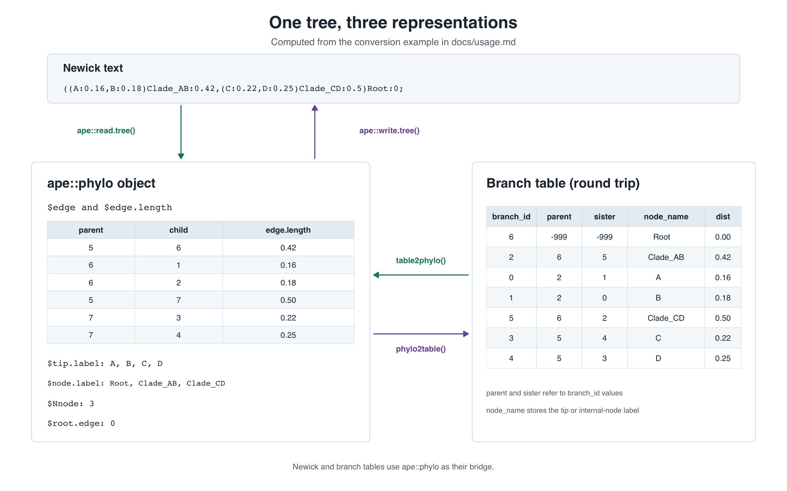
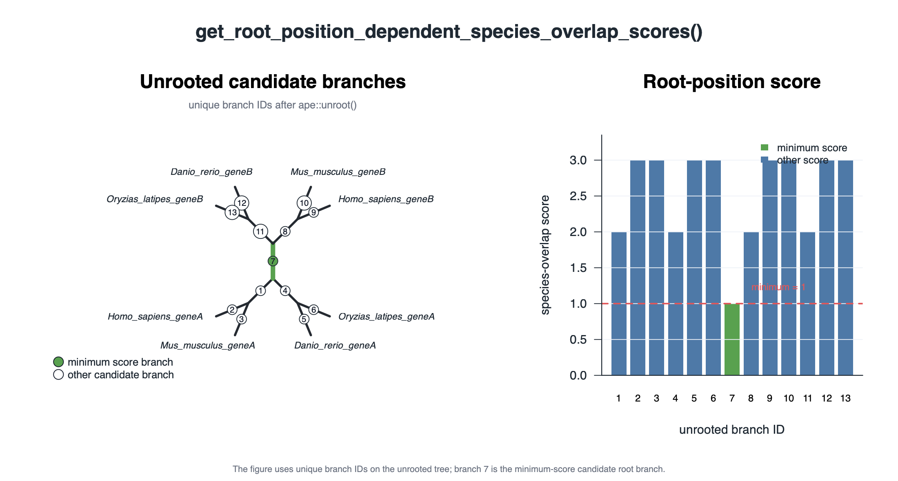

# Overview
[](https://github.com/kfuku52/rkftools/actions/workflows/r-cmd-check.yaml)
[](https://github.com/kfuku52/rkftools)
[](https://www.r-project.org/)
[](LICENSE.md)
[](https://github.com/kfuku52/rkftools/commits/master)
[](https://github.com/kfuku52/rkftools/issues)
[](https://github.com/kfuku52/rkftools/pulls)
[](https://github.com/kfuku52/rkftools)
[](https://github.com/kfuku52/rkftools/network/members)

This R package contains various tools to handle data in evolutionary biology.

# Dependency
Required:
* [R (>= 4.1.0)](https://www.r-project.org/)
* [ape](https://github.com/emmanuelparadis/ape)
* [phytools](https://github.com/liamrevell/phytools)

Optional (used by specific functions/modes):
* [PhylogeneticEM](https://github.com/pbastide/PhylogeneticEM)
* [Rphylopars](https://github.com/ericgoolsby/Rphylopars)

# Supported upstream outputs
rkftools includes helpers for objects and outputs produced by:
* [ape](https://github.com/emmanuelparadis/ape) `phylo` objects (`table2phylo()`, `phylo2table()`, and tree utilities)
* [l1ou](https://github.com/khabbazian/l1ou) outputs (`get_tree_table()`, `get_regime_table()`, `get_leaf_table()`, and `get_bootstrap_table()`)
* [PhylogeneticEM](https://github.com/pbastide/PhylogeneticEM) outputs (`get_tree_table()`, `get_regime_table()`, and `get_leaf_table()`)
* [NOTUNG](https://www.cs.cmu.edu/~durand/Notung/) parsable output (`read_notung_parsable()`)

# Installation
```r
install.packages("remotes")
remotes::install_github("kfuku52/rkftools", ref = "master")
```

# Examples

## Convert between Newick, ape::phylo, and a branch table

`table2phylo()` and `phylo2table()` convert between a branch table and an
`ape::phylo` object. Newick strings or files can be converted to and from
`ape::phylo` with `ape::read.tree()` and `ape::write.tree()`. `branch_id`,
`parent`, and `sister` are numerical labels. `parent` and `sister` refer to
`branch_id`, while `node_name` stores the tip or internal-node label.
`phylo2table()` returns the same schema with numerical labels generated from
clade signatures, matching genegalleon's `numerical_label` convention.
`table2phylo()` validates that the table describes one connected rooted tree
with at most two children per node, checks reciprocal sister relationships,
and preserves exact zero-length branches.

```r
library(rkftools)

branch_table = data.frame(
    branch_id=c(6, 2, 0, 1, 5, 3, 4),
    parent=c(-999, 6, 2, 2, 6, 5, 5),
    sister=c(-999, 5, 1, 0, 2, 4, 3),
    node_name=c("Root", "Clade_AB", "A", "B", "Clade_CD", "C", "D"),
    dist=c(0, 0.42, 0.16, 0.18, 0.50, 0.22, 0.25),
    stringsAsFactors=FALSE
)

tree = table2phylo(branch_table, name_col="node_name", dist_col="dist")
newick = ape::write.tree(tree)
tree_from_newick = ape::read.tree(text=newick)
roundtrip_table = phylo2table(tree_from_newick, name_col="node_name", dist_col="dist")
```



## Score candidate root positions by species overlap

```r
library(rkftools)

gene_tree = ape::read.tree(text=paste0(
    "(((Homo_sapiens_geneA:0.12,Mus_musculus_geneA:0.12):0.18,",
    "(Danio_rerio_geneA:0.16,Oryzias_latipes_geneA:0.16):0.14):0.25,",
    "((Homo_sapiens_geneB:0.11,Mus_musculus_geneB:0.11):0.19,",
    "(Danio_rerio_geneB:0.15,Oryzias_latipes_geneB:0.15):0.15):0.25);"
))

root_scores = get_root_position_dependent_species_overlap_scores(
    gene_tree,
    nslots=1
)
```

The figure uses unique branch IDs after unrooting the tree; the minimum-score
candidate root branch is branch 7.



# Parallel tuning
`MAD_parallel()` automatically uses available CPU cores when `ncpu` is omitted,
caps automatic parallelism at eight cores, and avoids parallel overhead for
small trees. Root-position species-overlap scoring now uses one bidirectional
tree traversal, so its legacy `nslots` argument is accepted for compatibility
but no worker pool is needed. `get_phy2_root_in_phy1()` likewise matches edge
bipartitions in one traversal and retains `nslots` only for compatibility.

To cap cores globally:
```r
options(rkftools.max_cores = 8)
```

# Input validation and optional integrations

Tree and trait helpers reject disconnected trees, duplicated tip labels,
malformed species identifiers, duplicated trait rows, and non-finite values
where these would make a result unreliable. Repeated internal-node labels such
as bootstrap values remain supported. `get_parsed_args()` does not print by
default; when printing is requested, credential-like values are redacted.

Functions backed by optional packages produce an installation error naming the
required package. Install `PhylogeneticEM` or `Rphylopars` when using their
corresponding modes or imputation helper.
